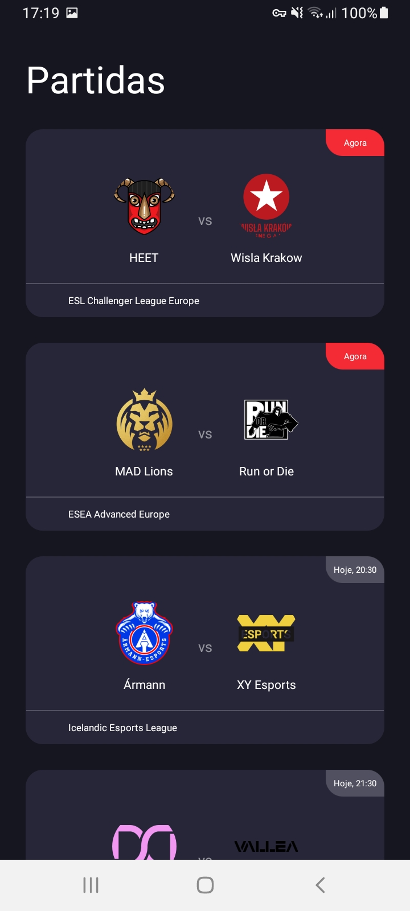
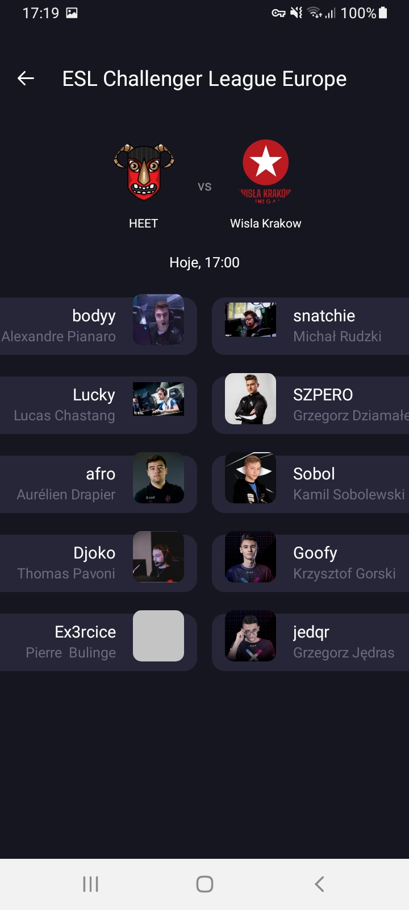

# CSTV

Fique por dentro das próximas partidas de CS:GO





## Executando
Clone o projeto e execute no Android Studio.
```
git clone https://github.com/MarcosAndre01/CSGOMatches
```
Lembre-se de não rolar muito a lista para não esgotar o uso da API kkkkk

## Detalhes do projeto

O desafio foi feito seguindo o [padrão MVVM](https://developer.android.com/jetpack/guide). 
As requisições para os serviços da API, utilizando [Retrofit](https://square.github.io/retrofit/) com [Gson](https://github.com/google/gson), são encapsuladas em classes [RemoteDataSource](app/src/main/java/com/example/csgomatches/data/matches/service/MatchesRemoteDataSource.kt) e estão retornando DTOs como, por exemplo, [MatchResponse](app/src/main/java/com/example/csgomatches/data/matches/service/MatchResponse.kt). Os [repositórios](app/src/main/java/com/example/csgomatches/data/matches/MatchesRepository.kt) convertem os resultados das requisições para tipos da ui.model, que são mais convenientes, já que as respostas da [API pandascore](https://developers.pandascore.co/docs) contém muitas informações desnecessárias para a UI.

A paginação do endpoint [/csgo/matches](https://developers.pandascore.co/reference/get_csgo_matches) foi resolvida com a [Jetpack Paging 3](https://developer.android.com/topic/libraries/architecture/paging/v3-overview) e implementada em [MatchesPagingSource](app/src/main/java/com/example/csgomatches/data/matches/paging/MatchesPagingSource.kt). Como esse endpoint não retorna a lista de jogadores, foi preciso adicionar um TournamentsRepository para pegar os dados do endpoint [/tournaments/{id}/rosters](https://developers.pandascore.co/reference/get_tournaments_tournamentidorslug_rosters), conforme [recomendado pela API](https://developers.pandascore.co/docs/tournaments-in-depth#tournaments-participants)

A [lista de partidas](app/src/main/res/layout/fragment_matches.xml) é uma única RecyclerView, enquanto que, na [lista de detalhes](https://github.com/MarcosAndre01/CSGOMatches/blob/main/app/src/main/res/layout/fragment_match_detail.xml), temos duas RecyclerViews (uma para o time do lado esquerdo e outra para o time do lado direito) dentro de uma NestedScrollView.

Na camada de UI o estado da interface é armazenado no ViewModel e observado pelos fragmentos.

Das coisas que faltam melhorar, destacam-se testes, responsividade dos layouts (apesar de usar ConstraintLayout, alguns valores estão hardcoded) e melhor tratamento de erros.
