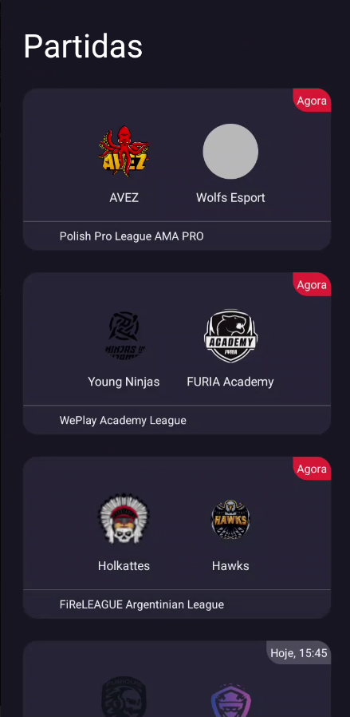
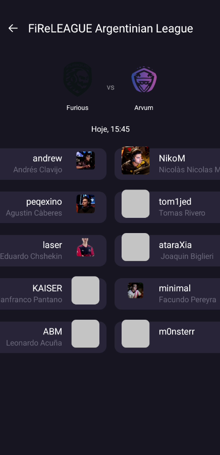

# CSGOMatches

 

Fique por dentro das próximas partidas de CS:GO!

## Detalhes do projeto
Essa aplicação foi desenvolvida com a finalidade de praticar conceitos em desenvolvimento Android utilizando a [API pandascore](https://developers.pandascore.co/docs) para mostrar os detalhes das partidas.

O projeto segue o padrão [MVVM](https://developer.android.com/jetpack/guide) utilizando Retrofit com Gson para fazer requisições à API. 
Além de resolver a paginaçã́o do endpoint [/csgo/matches](https://developers.pandascore.co/reference/get_csgo_matches) com a [Jetpack Paging 3](https://developer.android.com/topic/libraries/architecture/paging/v3-overview), 
implementando o [RemoteMediator](app/src/main/java/com/example/csgomatches/data/matches/paging/MatchesRemoteMediator.kt) 
que salva os dados localmente em um banco de dados offline [Room](https://developer.android.com/training/data-storage/room). 

São utilizadas diferentes classes para armazenar a resposta da API, as entidades no banco de dados e os objetos utilizados pela UI, com o devido [mapeamento](app/src/main/java/com/example/csgomatches/data/matches/MatchMapper.kt) entre elas.

Como esse endpoint não retorna a lista de jogadores, foi preciso adicionar um [TournamentsRepository](app/src/main/java/com/example/csgomatches/detail/data/tournaments/TournamentsRepository.kt) para pegar os dados do endpoint [/tournaments/{id}/rosters](https://developers.pandascore.co/reference/get_tournaments_tournamentidorslug_rosters), conforme [recomendado pela API](https://developers.pandascore.co/docs/tournaments-in-depth#tournaments-participants)

A [lista de partidas](app/src/main/res/layout/fragment_matches.xml) é uma única RecyclerView enquanto que, na [lista de detalhes](app/src/main/res/layout/fragment_match_detail.xml), temos duas RecyclerViews (uma para o time do lado esquerdo e outra para o time do lado direito) dentro de uma NestedScrollView.

Na camada de UI o estado da interface é armazenado no ViewModel e observado pelos fragmentos.

